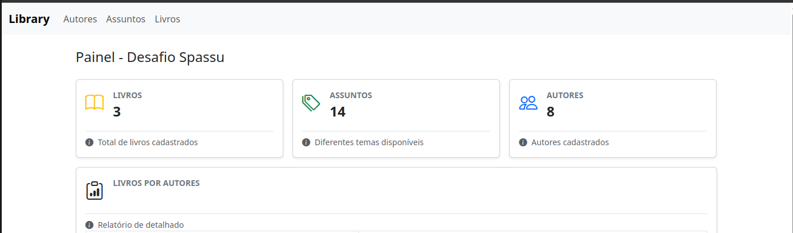

# Desafio Spassu

Este projeto é uma solução para o desafio proposto pela Spassu. Ele foi desenvolvido com o objetivo de atender aos requisitos especificados e demonstrar habilidades técnicas.



## Tecnologias Utilizadas

- **PHP 8.4**: Laravel Framework v12.
- **Node 20**: Vue3, Boostrap e Bootstrap-Icons.
- **Docker**: Docker Compose para subir o ambiente de desenvolvimento.

## Como Rodar o Projeto

Siga os passos abaixo para configurar e executar o projeto:

### Pré-requisitos

Certifique-se de ter instalado:

- [Docker e Docker Compose]
- [Makefile para rodar o script de inicialização] - `sudo apt install make`

### Passos

1. Clone o repositório:
    ```bash
    git clone https://github.com/seu-usuario/desafio-spassu.git
    cd desafio-spassu
    ```

2. Rode o comando make:
    ```bash
    make build-app 
    ```

3. Aguarde o build dos containers e  ✨ voilà ✨ o projeto está acessível para uso:
    - Acesse o projeto no navegador [clicando aqui -> http://localhost:8080](http://localhost:8080)
    - `http://localhost:8080` -- para acesso ao front
    - `http://localhost:8001` -- para acesso direto a API Laravel

## Estrutura do Projeto

- **/app**: Código-fonte principal.
- **/tests**: Testes automatizados.
- **/frontend**: App vue3 - front da app.
